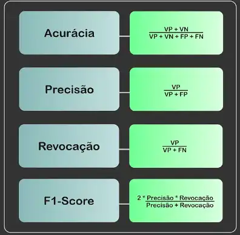
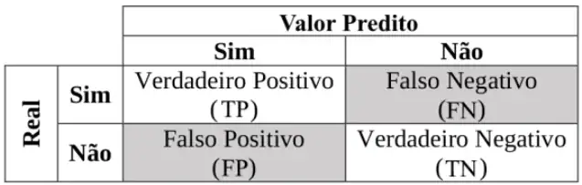
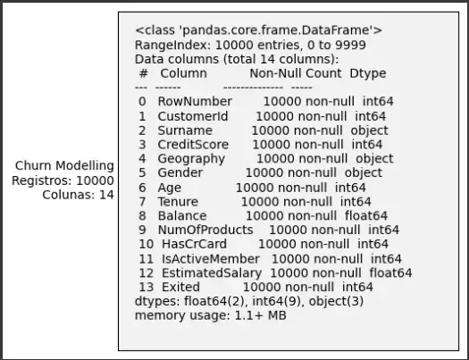
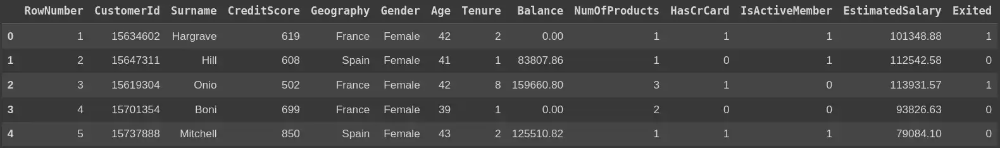
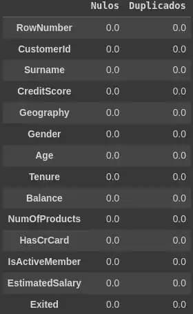
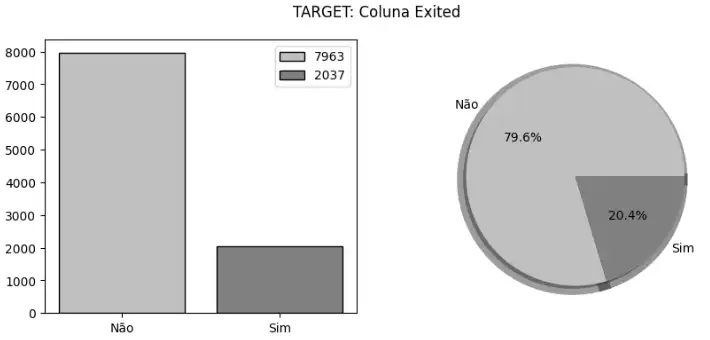
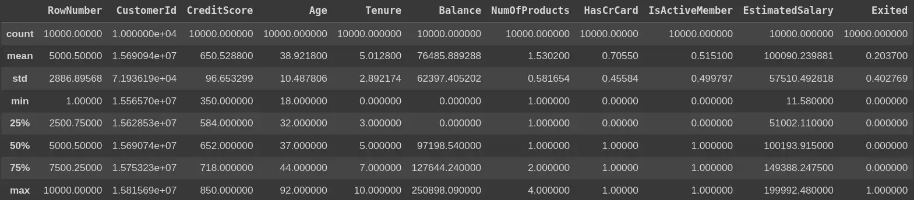
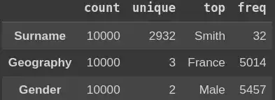
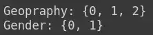
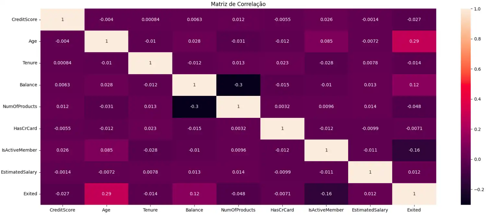

# Estudo de Caso: Análise Exploratória de Dados e Comparação de Modelos de Aprendizado de Máquina

### Salve família!!!
Cientista de Dados! Uma das profissões mais jovens, você não acha?

Esta especialidade surgiu nos meados dos anos 2000 e sua presença na área decolou rapidamente!

Agora, o mundo da tecnologia reconhece a importância do profissional em Ciência de Dados, que tem se tornado cada vez mais valorizado e procurado.

Mas, e você… Já viu Ciência de Dados na prática? O que um Cientista de Dados produz? Caso não tenha visto, vamos lá!

Teremos o seguinte trajeto:  

- Introdução (o que será abordado?)
- Apresentação de Conceitos Iniciais (qual a base teórica contida?)
- Contextualização: Entendendo o Problema (qual o enredo da história?)
- Análise Exploratória (mão na massa vol.1!)
- Aplicação dos Modelos (mão na massa vol. 2!!)
- Conclusão (como podemos aproveitar e aperfeiçoar o estudo?)
- Referências (não chegamos até aqui sozinhos…)

## 1. Introdução
Devido à forte competitividade de mercado e o aumento significativo da quantidade de dados gerados, as organizações precisam extrair deles informações valiosas. Estas são extremamente necessárias para tomadas de decisões estratégicas cada vez mais assertivas.

Neste contexto, o cientista de dados desempenha um papel fundamental, sendo responsável por coletar, limpar, analisar e interpretar volumes imensos (ou nem tanto) de dados, utilizando técnicas avançadas de análise e aprendizado de máquina.

Este artigo mostra um estudo de caso, aplicando conhecimentos de ciência de dados. Serão utilizadas técnicas de análise exploratória de dados. Além da implementação de modelos de aprendizado de máquina, aplicados a problemas de classificação. No final, será feita a apresentação dos indicadores alcançados, com comparação entre os resultados.

Para desenvolvimento dos códigos demonstrados, foi utilizada a linguagem de programação Python (a true love), através da plataforma Google Colaboratory.

## 2. Apresentação de Conceitos Iniciais
Antes de tudo, faz-se necessário percorrer alguns conceitos importantes, para melhor entendimento dos desafios propostos.

### 2.1 Ciência de Dados
Segundo Peter e Andrew Bruce, a Ciência de Dados é uma fusão de múltiplas disciplinas, incluindo estatística, ciências da computação, tecnologia da informação e campos de domínio específicos. Consequentemente, podem-se utilizar termos diferentes para se referir a este mesmo conceito. (Fonte: Practical Statistics for Data Scientists. 2020)

- Partindo dessa definição, devemos verificar as seguintes observações:

- A ciência de dados é considerada uma disciplina, enquanto os cientistas de dados são os praticantes desse campo;

- É comum confundir os conceitos de ciência de dados e inteligência de negócios (BI), pois ambos se relacionam com os dados de uma organização. Mas as duas áreas possuem focos diferentes;

- Embora a profissão de cientista de dados seja relativamente recente, o termo ciência de dados apareceu pela primeira vez na década de 1960, como um nome alternativo para estatísticas.

Na figura abaixo, está sendo apresentado John Tukey, ilustre estatístico americano que formulou ideias, consideradas fundamentos da ciência de dados.


### 2.2 Análise Exploratória de Dados
A análise exploratória de dados (Exploratory Data Analysis - EDA) inclui métodos para explorar conjuntos de dados, a fim de resumir suas principais características e identificar quaisquer problemas nos dados. Utilizando métodos estatísticos e visualizações, você pode obter informações sobre um conjunto de dados para determinar sua prontidão para análise e informar quais técnicas aplicar para a preparação dos dados. (Fonte: Exploratory data analysis on Databricks: Tools and techniques. 2023)

Existem quatro abordagens principais para análise exploratória:

- Análise uni-variada não gráfica: o objetivo principal é descrever os dados e encontrar padrões existentes neles. Entretanto, como se trata de uma única variável, não lida com causas ou relações;

- Análise uni-variada gráfica: utilizada para fornecer um entendimento mais completo às análises não gráficas, através da visualização de histogramas, box-plot e diagramas de caule e folhas;

- Análise multivariada não gráfica: geralmente mostram a relação entre duas ou mais variáveis por meio de medidas estatísticas, como coeficiente de correlação;

- Análise multivariada gráfica: tem como objetivo visualizar relações entre duas ou mais variáveis. Para isso, são utilizados comumente, gráficos de dispersão, gráfico de bolhas, mapas de calor e matrizes de correlação.

### 2.3. Aprendizagem de Máquina
Aprendizagem de máquina (Machine Learning) é um subcampo da inteligência artificial, que é amplamente definida como a capacidade de uma máquina imitar o comportamento humano inteligente. Sistemas de inteligência artificial são usados para realizar tarefas complexas de forma semelhante à maneira como os humanos resolvem problemas. (Fonte: Machine learning, explained. 2021)

Na prática, os modelos de Machine Learning buscam reconhecer padrões. Além disso, são divididos em dois tipos.

- Modelos supervisionados: conhecemos o valor que queremos predizer. Aplicados a problemas de classificação ou regressão;

- Modelos não-supervisionados: não conhecemos o que queremos predizer. Aplicados a problemas de clusterização.

#### 2.4 Métricas de Avaliação de Modelos
Existem várias métricas para verificação da qualidade de predição e desempenho de um modelo. Porém, como neste estudo de caso é utilizado um problema de classificação, vamos nos atentar as seguintes métricas:

- Acurácia (accuracy): representa a proporção de exemplos corretamente classificados em relação ao total de exemplos no conjunto de dados. Indica uma performance geral do modelo;

- Precisão (precision): também chamada de valor preditivo positivo, esta métrica verifica a proporção de exemplos positivos corretamente classificados como positivos, em relação a todos os exemplos classificados como positivos pelo modelo;

- Revocação (recall): também conhecida como taxa de recuperação ou sensibilidade, representa a capacidade de um modelo em identificar corretamente os exemplos positivos entre todos os exemplos positivos existentes no conjunto de dados;

- Escore F1 (F1-Score): métrica calculada a partir da média harmônica entre a precisão e o recall, fornecendo uma medida entre a capacidade do modelo de identificar corretamente exemplos positivos e evitar falsos positivos;



- Matriz de confusão (confusion matrix): é uma tabela onde se visualiza a contagem de previsões corretas e incorretas feitas pelo modelo, permitindo a análise de erros da classificação.



Vale ressaltar que as métricas foram apresentadas de forma resumida. Fica como sugestão a pesquisa mais profunda da definição e aplicação de cada uma delas.

## 3. Contextualização: Entendendo o Problema
Apesar dos esforços contínuos dos bancos para atrair e reter clientes, o setor bancário enfrenta um desafio constante, apresentado na forma de perda de clientes, levando a prejuízos financeiros.


É vantajoso para os bancos saber o que leva um cliente à decisão de sair da empresa ou deixar de consumir determinado serviço bancário. Logo, este pequeno projeto tem como variável alvo (target) a taxa de rotatividade  (churn rate) de clientes de um banco, a partir de um conjunto de dados apresentando as características destes clientes (features), disponibilizados na plataforma Kaggle.

Após a análise, serão realizados treinos de modelos de aprendizado de máquina. E, a partir dos resultados, podem ser geradas conclusões úteis, para  entender os principais fatores que influenciam significativamente na saída do cliente.

No final, serão visualizados os resultados da modelagem, a partir da verificação de métricas. Além disso, serão apresentadas possíveis melhorias, através da sugestão de aplicações de metodologias mais avançadas, que não fazem parte deste estudo.

## 4. Análise Exploratória
Acendam as luzes, pois o momento é chegado! A partir de agora serão apresentados trechos de código para exploração e tratamento de dados.

Durante o desenvolvimento, as principais bibliotecas utilizadas foram Pandas e NumPy para manipulação de dados, Scikt-Learn para utilização de modelos e métricas, e também os pacotes de visualização Matplotlib e Seaborn.

### 4.1 Preparação do Ambiente
- Importação de Bibliotecas

```py
#@title Importação de Bibliotecas

import pandas as pd #Manipulação de conjuntos de dados
import numpy as np #Manipulações numéricas
import matplotlib.pyplot as plt #Análises gráficas
import seaborn as sns #Análises gráficas
import io #Manipulação de entradas e saídas
import gdown #Acesso a arquivos no Google Drive

from matplotlib.widgets import TextBox #Visualização de textos
from sklearn.preprocessing import StandardScaler #Normalização dos dados
from sklearn.neighbors import KNeighborsClassifier #Modelo KNN
from sklearn.ensemble import RandomForestClassifier #Modelo Floresta Aleatória
from sklearn.model_selection import train_test_split #Divisões dos conjuntos treino/teste
from sklearn.metrics import accuracy_score, precision_score, recall_score, f1_score #Extração de indicadores
from sklearn.metrics import confusion_matrix, ConfusionMatrixDisplay #Extração de matrizes
```

- Importação do Conjunto de Dados

```py
# @title Importação do Conjunto de Dados

FILE = "17q-pzYIT--eNojoZDLDQRWrt6ADjiIH-"
URL = f"https://drive.google.com/uc?id={FILE}"
OUTPUT = "Churn_Modelling.csv"
gdown.download(url=URL,output=OUTPUT)
df = pd.read_csv(OUTPUT)
```

### 4.2 Visualização do Conjunto de Dados
- Verificação das Informações do Conjunto

```py
# @title Verificação das Informações do Conjunto de Dados

buffer = io.StringIO()
df.info(buf=buffer)
s = buffer.getvalue()

plt.figure(figsize=(5,5))
ax = plt.subplot()
texto=f'''
Churn Modelling
Registros: {df.shape[0]}
Colunas: {df.shape[1]}
'''
textBox = TextBox(ax,label=texto,initial=s)

plt.show()
```



Observação: a utilização do método info para DataFrame é de extrema importância. A partir dele é verificada a quantidade de registros em cada coluna e os respectivos tipos de dados. Através destas verificações, podemos prever necessidade de manipulações e tratamentos de variáveis.

- Visualização dos Dados

```py
# @title Visualização do Conjunto de Dados (a partir de agora chamado de DataFrame)
df.head()
```



Observação: assim como o info, a utilização do método head é quase obrigatória. Não podemos explorar dados sem visualização. Apresenta, por padrão, os cinco primeiros registros do DataFrame.

### 4.3 Aplicação de análises uni-variadas não gráficas
- Verificação da Quantidade de Dados Nulos ou Duplicados

```py
nulos = df.isnull().sum()
duplicados = df[df.duplicated()].sum()
display(pd.DataFrame([nulos, duplicados])
        .T
        .rename(columns={0:"Nulos",1:"Duplicados"})
       )
```



Observação: este conjunto de dados, especificamente, não apresenta ausência de valores ou repetição deles (na maioria dos casos isso não ocorre). Caso apresentasse, seria necessário aplicar alguma técnica de tratamento, ou até mesmo o descarte de determinadas colunas.

- Verificação de Balanceamento da Variável Alvo (TARGET)

```py
# @title Verificação de Balanceamento da Variável Alvo (TARGET)

count = df[['Exited']].value_counts().values

fig = plt.figure(figsize=(10,4))
fig.suptitle('TARGET: Coluna Exited')

plt.subplot(1,2,1)
plt.bar(["Não","Sim"],count,color=['silver','gray'], label=count, edgecolor = "black") 
plt.legend()

plt.subplot(1,2,2)
plt.pie(count, colors=['silver','gray'], labels=["Não","Sim"],autopct="%1.1f%%", shadow=True,wedgeprops = {'linewidth': 10})

plt.show()
```



Observações: os valores da variável alvo devem ser analisados com uma certa importância. Primeiramente, como se trata de um problema de classificação, podemos concluir que existem duas classes, a partir da quantidade de resultados possíves.

Classe 1 - Valor 0 ou "NÃO": representa clientes que se mantiveram no banco.

Classe 2 - Valor 1 ou "SIM": representa clientes que saíram.

Os gráficos confirmam um desbalanceamento do target, pois 80% das ocorrências foram da classe 1 e 20% da classe 2. Esta característica pode influenciar no resultado dos modelos (ou não).

- Resumo das Variáveis Numéricas

```py
# @title Resumo das Variáveis Numéricas
display(df.describe(include=[np.number]))
```



Observação: outro método muito poderoso é o describe. Para as variáveis numéricas, são disponibilizadas informações de medidas de posição, como média, moda e quartis.

- Resumo das Variáveis não Numéricas

```py
# @title Resumo das Variáveis não Numéricas
display(df.describe(include=[object]).T)
```



Observação: o describe também pode ser aplicado à variáveis não numéricas, trazendo outros tipos de informações.

### 4.4 Aplicação de análises multivariadas gráficas
Antes da apresentação das análises, faz-se necessários realizar transformações nos dados, para melhor compreensão.

- Limpeza do Conjunto de Dados

```py
# @title Retirada das Colunas sem Utilização
df = df.drop(columns=['RowNumber','CustomerId','Surname']) 
```

- Transformação das Colunas Categóricas

```py
# @title Verificação dos Valores das Colunas Categóricas
print(f"Geopraphy: {set(df['Geography'])}")
print(f"Gender: {set(df['Gender'])}")
```


```py
# @title Codificação Ordinal das Colunas Categóricas
dictGeography = {"Germany" : 0, "France" : 1, "Spain" : 2}
df["Geography"] = df["Geography"].map(dictGeography)

dictGender = {"Male" : 0, "Female" : 1}
df["Gender"] = df["Gender"].map(dictGender)

print(f"Geopraphy: {set(df['Geography'])}")
print(f"Gender: {set(df['Gender'])}")
```



Observação: uma boa prática em análise exploratória e aprendizado de máquina, transformar as codificar as variáveis categóricas. O modelo performar melhor trabalhando com valores numéricos inteiros do que textos.

- Apresentação da Matriz de Correlação

```py
# @title Montagem de Matriz de Correlação
correlacao = df.corr()
plt.figure(figsize=(20,8))
ax = sns.heatmap(correlacao,annot=True)
plt.title("Matriz de Correlação")
plt.show()
```



Observação: a matriz de correlação apresenta uma maneira fácil para visualizar a relação entre variáveis. Os coeficientes de correlação, calculados através de outro método para DataFrame, o corr, são dispostos numa matriz. Através de uma breve análise, por exemplo, podemos concluir que a variável que possui a maior correlação (mesmo que não muito alta, 0.29) com o nosso target é a Age.

Lembrando que as análises exploratória de dados foram apresentadas de forma resumida. Fica como sugestão a visualização de outros textos, indicados nas referências logo no final do artigo, para aprofundamento do assunto.